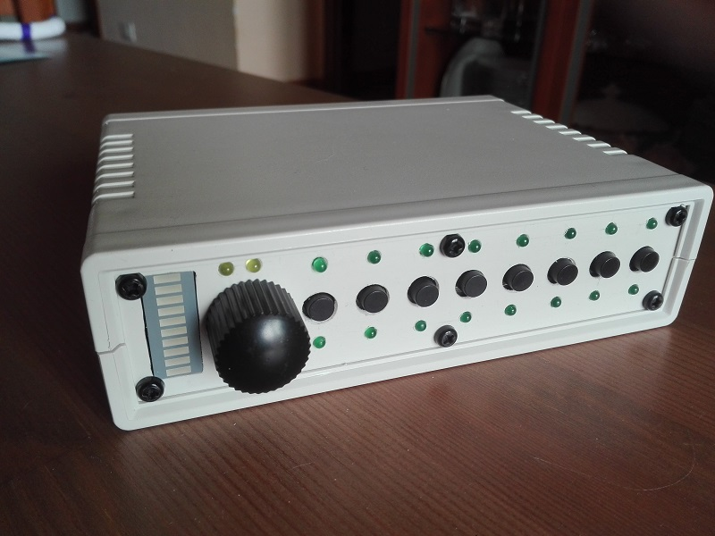

# MusicalBOX *"rev2"*
This is an open-source, home project, for a *cheap magic musical box* that help me to play on-stage with my [band](https://www.facebook.com/groups/nurserycrymeband).  
Basically is an audio samples player based on RaspberryPi, derived from the original project of [Joseph Ernest's SamplerBox](https://github.com/josephernest/SamplerBox/).

Audio stereo samples, wav files stored on the RaspberryPI microSD folders (the presets), are selected one-by-one by 8 switches.
A short press of switches selects the presets on bank1 (presets 1-8), while long press (about 1 second) selects the presets on bank2 (presets 9-16),
allowing up to 16 selectable presets.
Selected preset can be routed, by switch selection, to one or both of two output lines (usefull when different sounds must go through different effect lines).

## Features
- All the features of the original SamplerBox project
- Up to 16 selectable presets splitted into 2 banks
- Two selectable stereo output lines, connected to the RaspberriPi audio DAC, via hardware routing logic
- Permanent saving of preset+routing configurations (the programs)

## Changes
See file [CHANGES](CHANGES.md) for the project resources change logs

## Future Plans
See file [TODO](TODO.md) for the project future plans

## About
Author : Alessandro Fraschetti (mail: [gos95@gommagomma.net](mailto:gos95@gommagomma.net))

## License
This project is licensed under the [Creative Commons BY-SA 3.0](http://creativecommons.org/licenses/by-sa/3.0/) License

## Credits
Many thanks to Joseph Ernest for his original [SamplerBox](https://github.com/josephernest/SamplerBox/) project